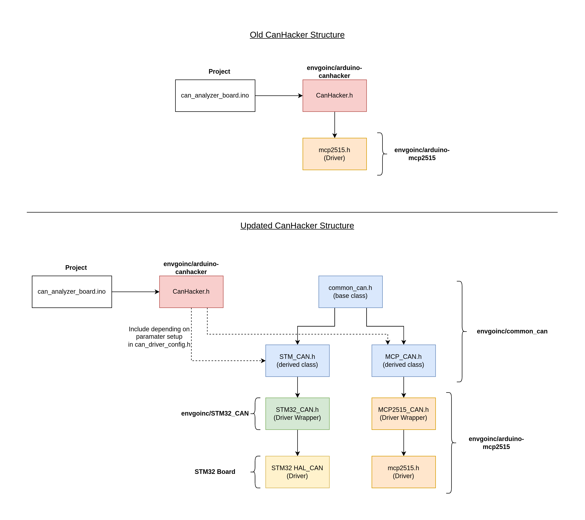

# CanHacker (lawicel) CAN adapter on Arduino + MCP2515

## enVgo Library Structure and Flow 

## enVgo Driver Configuration

To configure if MCP2515 or STM32 driver should be used, uncomment/comment the respective lines in `can_driver_config.h`

Use that [Library](https://github.com/autowp/arduino-mcp2515) to communicate with MCP2515

---

## Features

Implement communication with CAN bus via MCP2515 by CanHacker (lawicel) protocol.

- send & receive can frames
- supports standart (11 bit) & extended (29 bit) frames
- supports remote frames (RTR)
- supports filter by ID (mask + code)
- interface using [Stream](https://www.arduino.cc/en/Reference/Stream): ability to work with Serial, SoftwareSerial, Ethernet and other
- supported can baudrates from 10Kbps up to 1Mbps
- supported modules with different oscillators (8, 16, 20 MHz), 16 MHz is default, use setClock if your oscillator is not 16MHz
- support [CanHacker](http://www.mictronics.de/projects/usb-can-bus/) (application for Windows)
- support [CANreader](https://github.com/autowp/CANreader) (application for Android)

## Documentation

[English](docs/en/)

[Русский](docs/ru/)

## Library Installation

1. Install [MCP2515 Library](https://github.com/autowp/arduino-mcp2515)
2. Download the ZIP file from https://github.com/autowp/arduino-canhacker/archive/master.zip
3. From the Arduino IDE: Sketch -> Include Library... -> Add .ZIP Library...
4. Restart the Arduino IDE to see the new "canhacker" library with examples

Testes with Arduino Nano.
On Arduino Uno have problem with too long boot period and losing first command

## Contributing

Feel free to open issues, create pull requests and other contributions
